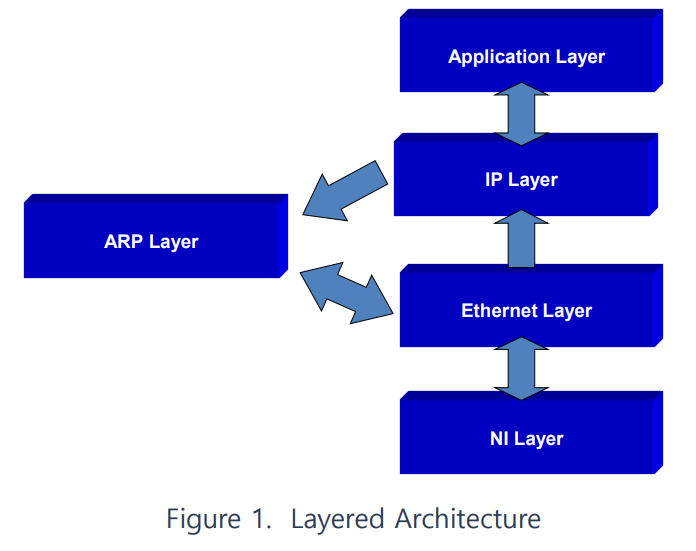

# ARPWithMFC
ARP Implementation with MFC 

## 인원   

|이름 | E-mail | ID |
| ---| ---| ---|
| 박정현 | rkwaol216@gmail.com| BiteSnail|
| 남동욱 | egddbr1213@naver.com | egddbr1213 |
| 신용인 | brin7584@gmail.com | poeo1877 |
| 이석호 | choonarm3@gmail.com | choonarm3 |
| 최준희| junhee9807@gmail.com | serhong |
| 최재웅| jaewoongchoi46@gmail.com | sleepychoi |

## Dependency
`WinPcap` [Download](https://www.winpcap.org/)   
`MFC` <i>다운은 VisualStudio Installer에서 가능</i>

## 실습 목적
ARP의 구조와 작동 방법을 파악한다.

## 실습 시나리오
1. ARP Request 및 Reply를 받을 NIC를 선택 및 개방한다.
2. MAC 주소를 구하고자하는 IP주소를 입력한다.
3. 전송 버튼을 누른다.
    1. APR Cache Table에 Interface, IP Address(Domain name), Ethernet Address(?), Status 항을 하나 추가하여 값을 넣는다.
4. ARP Request 패킷을 작성한다.
    1. Hardware Type은 1(MACADDRESS), Protocol Type은 0x0800(IP)를 사용한다.
    2. Opcode를 1(ARP Request)로 설정한다.
    3. Sender영역에 자신의 MAC주소와 IP주소를 설정한다.
    4. Target영역에 hardware는 0으로 채우고 protocol address는 목적지 IP주소를 설정한다.
5. Ethernet헤더를 작성한다.
    1. Ethernet Header의 Destination Address를 Broadcast 주소로 채운다.
    2. Ethernet Header의 Source Address를 자신의 MAC 주소로 채운다.
    3. Etherent Type을 0x0806(ARP)으로 설정한다.
6. 레이어 아키텍쳐에 의해서 Encapsulated Packet이 만들어짐 (Ethernet frame)
7. NILayer의 Pcap 라이브러리로 작성된 코드에 의해 packet은 네트워크로 전송된다.
8. OnTimer를 설정(180sec)한다.
9. 패킷을 수신한다.
    1. 하위 레이어부터 수신된 프로토콜이 PC 1로부터 보내진 패킷인지 검사
        * 아니라면, discard(버림)
    2. 맞으면, 레이어 아키텍쳐에 의해서 Demultiplexing을 통해 header를 제외한 data 부분을 상위 레이어로 전달
        * Header는 매 레이어마다 receive 함수에서 frame에 대해 나에게 온 것이 맞는 검사할 때 쓰임
    3. 최상위 레이어 (*Dlg.cpp)에 전달 될 때 까지 1번과 2번 과정을 반복함
    4. 전달된 결과 확인
10. 요청한 IP에 해당하는 MAC주소가 Timer안에 수신된 경우 ARP Cache Table에 Complete로 표시
11. 만약 수신하지 못한 경우 InComplete로 유지

## 프로토콜 스택
프로그램을 이루고 있는 기본적인 구조와 역할에 대한 설명입니다.

### 구조 설명

> 출처 : woojin415@naver.com   

### 각 레이어의 역할
#### Application Layer
1. 사용자로부터 네트워크 어뎁터 설정
2. Target IP주소로 ARP Request 보내기

#### IP Layer
1. IP주소를 통한 호스트 구분이 가능하게 함
2. ARP Layer로 ARP Request 패킷 전송

#### ARP Layer
1. ARP Request, Reply 패킷 처리

#### Ethernet Layer
1. 송수신 MAC 주소 설정

#### NI Layer
1. 선택된 어뎁터로부터 프레임 전송 및 수신
2. 선택된 어뎁터의 MAC 주소 가져오기